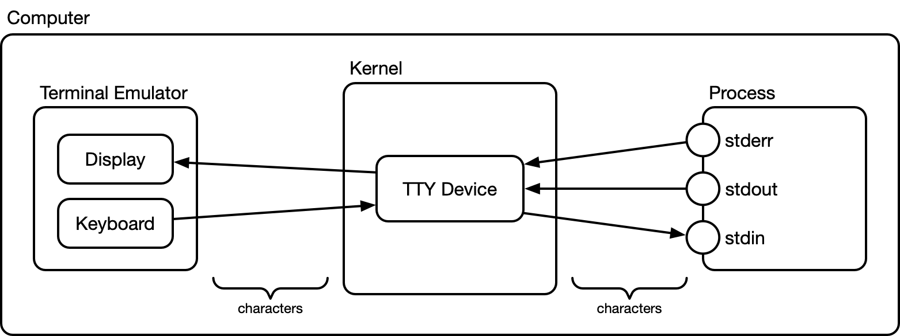
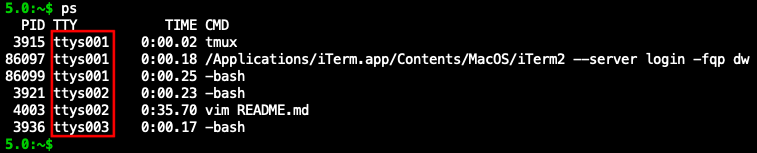
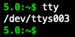
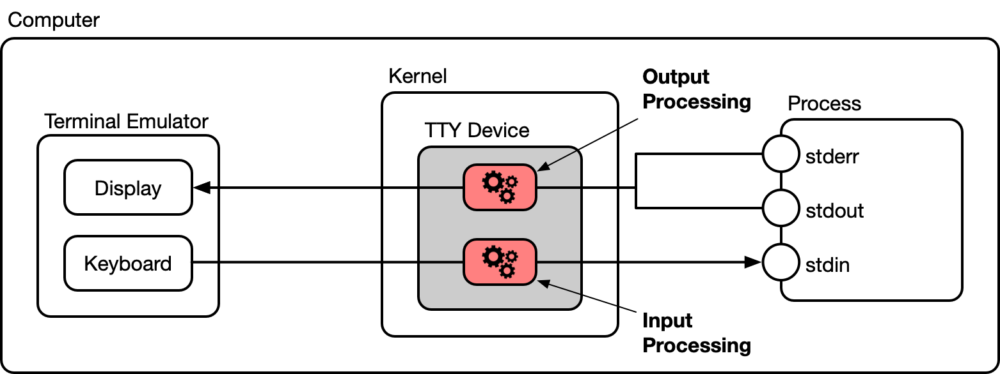

# Keyboard Inspector

Inspect the ASCII codes of the characters (and character sequences) produced by the keys (and key combinations) of your keyboard.

## Usage

Compile:

~~~bash
gcc -o kbi kbi.c
~~~

Run:

~~~bash
./kbi
~~~

Now you can start pressing any keys and key combinations on your keyboard, and the program prints the [ASCII codes](http://www.asciitable.com/) of the produced characters, or character sequences, in hexadecimal and octal notation.

To exit the program, type `Ctrl-C`.

## How does it work?

In order to receive every character as it is typed on the keyboard, the `kbi` process sets the **TTY device**, to which its stdin is connected, to **raw mode**. This means that the TTY device does not do any processing or interpretations of the characters it receives from the keyboard, but it forwards them all straight to `kbi`'s stdin.

## Background

### The TTY Subsystem

In UNIX, terminal emulators (e.g. xterm, iTerm, Terminal.app, etc.) are connected to the [standard streams](https://en.wikipedia.org/wiki/Standard_streams) of application processes through so-called TTY devices in the kernel. This is shown in the following diagram:

The kernel initialises a TTY device for every terminal emulator instance on the system. A terminal emulator window or tab, or a window or pane of a terminal multiplexer like [tmux](https://github.com/tmux/tmux) or [screen](https://www.gnu.org/software/screen/) all count as an independent terminal emulator instance. So, for example, if you're running two tabs of iTerm, then you have two terminal emulator instances, and thus two active TTY devices on your system. Or if you're running two panes of tmux in an iTerm window, then you have three terminal emulator instances (one for the iTerm window and two for the tmux tabs), and thus three active TTY devices.

You can think of a TTY device as a terminal driver. Through a TTY device, an application can read input from a terminal (what the user types on the keyboard) and it can write output to this terminal (displayed on the terminal screen). The application talks only to the TTY device, and is thus shielded from the low-level details of communicating directly with the terminal. From the point of view of an application, talking to a TTY device is like talking to a terminal device, hence the name *TTY device*.

Communication between an application and a TTY device happens by the means of the application's [standard streams](https://en.wikipedia.org/wiki/Standard_streams), which are stdin, stdout, and stderr. An application can have its standard streams connected to a specific TTY device. If stdin of a process is connected to a TTY device, this means that everything the user types on the keyboard of the corresponding terminal appears in stdin of this process. And if stdout or stderr of a process is connected to a TTY device, this means that everything the process writes to stdout or stderr will be sent to the terminal screen of the corresponding terminal.

The standard streams of processes can be individually "redirected" to different "locations". For example, to a file, a [pipeline](https://en.wikipedia.org/wiki/Pipeline_(Unix)), or another device driver. However, a TTY device is the **default location** of all standard streams for processes started from a shell. More precisely, each shell has its standard streams connected to a specific TTY device, and child process inherits the standard stream from its parent process. You can see the TTY devices associated with all running processes by executing the `ps` command:

As you can see, there are three shells and some other processes running, and they are connected to a total of three TTY devices named `ttys001`, `ttys002`, and `ttys003` (this is the naming of TTY devices on macOS, it might be different on other systems). This also means that there are three terminal emulator instances running on this system, which in this example were one iTerm2 window and two tmux panes.

As mentioned, TTY devices are in fact drivers, and UNIX has a nice property to make driver interfaces available as files in the `/dev` directory. If you go to check this directory, you will see that there exist three files named `/dev/ttys001`, `/dev/ttys002`, and `/dev/ttys003`. These are the interfaces to the respective TTY devices.

You can find out which TTY device a given terminal is connected to by executing the `tty` command:

As a fun fact: if you write something to the TTY device file of another terminal, e.g. `echo hello >/dev/ttys002`, the string will appear on the other terminal. For the `ttys002` TTY device, this is the same as when you do `echo hello` in the shell that is connected to `ttys002`. The TTY device just gets an order to send a coupld of characters to its associated terminal, but it doesn't distinguish *who* gives it this order.

### Actions of a TTY Device

What does a TTY device actually do? From a high-level view, it does two things:

- Reading characters from the terminal keyboard (with hardware terminals they were received on a RS-232 serial port, with terminal emulators it is some other interface), and writing  characters to the driver interface (represented by the `/dev/tty*` file).
- Reading characters from the driver interface (also represented by the `/dev/tty*` file), and writing characters to the terminal screen.

However, the TTY device does some more things between these read and write actions. Namely, it interprets and processes input characters (received from the keyboard), and the same applies (in a more limited way) to output characters (to be sent to the screen). This is shown in the following diagram:

The purpose of these processings is to move common tasks (that many applications would have to do anyway) into the TTY device so that applications don't have to implement them themselves.

The most important of these processings is the **line discipline** that the TTY devices applies to the input characters. It causes the TTY device to buffer received characters until a line is complete, that is, until it receives a *carriage return* character. Only at this point, the TTY device sends the whole sequence of characters to its driver interface where it is made available to stdin of the attached process. In addition to that, the line discipline also includes line editing. This means that when the user types, for example, a *delete* character, then the line discipline deletes the last typed character in the buffer.

So, for example, when the user types the following character sequence `This was bad<DEL><DEL><DEL>good`, the string that the TTY device will send to stdin of the process is `This was good`. The line discipline of the TTY device took care of interpreting the `<DEL>` characters and editing the entered text appropriately. The line discipline also keeps track of the cursor position in the entered line, manages cursor movements. It also interprets special characters for deleting parts of a line at once (usually produced by typing `Ctrl-U`, or `Ctrl-K` on the keyboard), and does many more things.

In general, this mode of the TTY device is called **canonical mode** and it is enabled by default. It stands in contrast to raw mode in which the line discipline is disabled, and the TTY device doesn't do any input or output processing at all. In reference to raw mode, canonical mode is also sometimes called **cooked mode**.

Another important function of the TTY device (especially for canonical mode) is **echo**. This simply sends every character that the user types back to the terminal so that it's displayed on the screen. This is necessary, because terminals don't display anything on their screen by themselves. Everything that is displayed on terminal screen is "commanded" by the application to which the terminal is attached. Since in canonical mode, a single character typed typically doesn't yet reach the application (it only reaches the application when an entire line has been entered), it is the TTY device that has to take care of "echoing" typed characters back to the terminal so that the users see what they type. Otherwise (for example, in raw mode) it is the application that has to take care of that.

Other things that the TTY device does includes the following:

- On input, replace *carriage return* characters with a *line feed* (i.e. *newline*) character (this is because the *return* key on keyboards usually produces a *carriage return*, but most UNIX programs expect *line feed* characters)
- On input, interpret control characters that are typically typed on a keyboard as `Ctrl-D`, `Ctrl-C`, `Ctrl-V`, etc.
- On output, replace *line feed* characters by a pair of a *carriage return* and a *line feed* character

Beyond that, the TTY device does a plethora of other low-level things (most apply to the input, but some also to the output).

### Configuring the TTY Device

As you have seen, the TTY device does a lot of things. The good thing is that all this is fully configurable. The `stty` command allows you to configure the TTY device to which your current shell is connected. If you execute `stty -a` you see the current configuration of the TTY device. You can for example execute `stty -echo` to disable the echo functionality. If you do this, characters that you type will not appear on the screen anymore. To re-enable echo, type `stty echo`.

You can enable raw mode (disabling any input and output processing) by running `stty raw`, and disabling it again with `stty -raw`. In any case, you can revert the TTY device configuration to a default state by running `stty sane`.

The TTY device can also be configured with the  functions in the [`termios.h`](https://linux.die.net/man/3/termios) header file in the POSIX C standard library. This is what the program in this repository uses to set the TTY device to raw mode, and revert it back to a canonical mode on exit.
